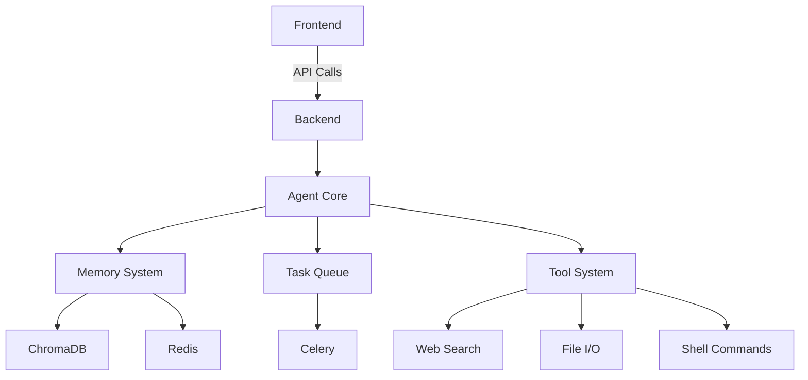

# M31-Mini: Autonomous Agent Framework

[](https://opensource.org/licenses/MIT)
[](https://github.com/TonmoyInfrastructureVision/M31-Mini/actions)
[](https://hub.docker.com/r/tonmoy/m31-mini)

M31-Mini is a production-ready fullstack autonomous agent framework designed for real-world use in professional environments.


## Table of Contents
- [Features](#features)
- [System Architecture](#system-architecture)
- [Quick Start](#quick-start)
- [Installation](#installation)
- [Configuration](#configuration)
- [Usage](#usage)
- [API Reference](#api-reference)
- [Development](#development)
- [Contributing](#contributing)
- [License](#license)

## Features

### Core Capabilities
- 🧠 **Intelligent Agents**: Create autonomous agents that can think, plan and execute tasks
- 🔧 **Modular Tools**: Extensible tool system (web search, file I/O, shell command execution)
- 💾 **Dual Memory System**: Long-term (ChromaDB) and short-term (Redis) memory
- 🔄 **Asynchronous Execution**: Celery-based task processing for scalability
- 🌐 **Modern Web UI**: React-based dashboard for agent creation and management
- 🔌 **API-First Design**: RESTful API for easy integration
- 🐳 **Containerized**: Docker-based setup for easy deployment

### Advanced Features
- Real-time task monitoring
- Memory visualization
- Agent performance metrics
- Custom tool development
- API documentation
- Webhook support

## System Architecture



## Quick Start

### Prerequisites
- Docker and Docker Compose
- Make (optional)
- OpenRouter API Key
- Serper API Key

### Docker Setup
```bash
git clone https://github.com/TonmoyInfrastructureVision/M31-Mini.git
cd M31-Mini
cp .env.example .env
# Edit .env with your API keys
make build
make up
```

Access the UI at [http://localhost:3000](http://localhost:3000)

## Installation

### Docker (Recommended)
```bash
docker-compose up -d
```

### Manual Setup
1. Backend:
```bash
cd backend
python -m venv venv
source venv/bin/activate
pip install -r requirements.txt
```

2. Frontend:
```bash
cd frontend
npm install
npm run dev
```

## Configuration

### Environment Variables
| Variable | Description | Required |
|----------|-------------|----------|
| `OPENROUTER_API_KEY` | OpenRouter API key | Yes |
| `SERPER_API_KEY` | Serper API key | Yes |
| `REDIS_URL` | Redis connection string | No |
| `CHROMA_URL` | ChromaDB connection string | No |
| `LOG_LEVEL` | Logging level | No |

### Configuration Files
- `backend/config/settings.py` - Backend configuration
- `frontend/.env` - Frontend configuration

## Usage

### Creating an Agent
1. Navigate to the dashboard
2. Click "Create Agent"
3. Enter agent details:
   - Name
   - Description
   - Model selection
   - Tools selection
4. Click "Create"

### Running a Task
1. Select an agent
2. Enter task description
3. Click "Run Task"
4. Monitor progress in task view

### API Usage
```python
import requests

url = "http://localhost:8000/api/v1/agent"
headers = {"Authorization": "Bearer YOUR_API_KEY"}
data = {
    "name": "Research Assistant",
    "description": "Agent for research tasks",
    "model": "gpt-4"
}

response = requests.post(url, json=data, headers=headers)
```

## API Reference

### Agent API
| Endpoint | Method | Description |
|----------|--------|-------------|
| `/api/v1/agent` | POST | Create agent |
| `/api/v1/agent/{id}` | GET | Get agent details |
| `/api/v1/agent/{id}/task` | POST | Create task |
| `/api/v1/agent/{id}/memory` | GET | Get agent memory |

### Task API
| Endpoint | Method | Description |
|----------|--------|-------------|
| `/api/v1/task` | POST | Create task |
| `/api/v1/task/{id}` | GET | Get task status |

## Development

### Backend
```bash
cd backend
uvicorn main:app --reload
```

### Frontend
```bash
cd frontend
npm run dev
```

### Running Tests
```bash
cd backend
pytest
```

## Screenshots


## Contributing
1. Fork the repository
2. Create a new branch
3. Commit your changes
4. Push to the branch
5. Create a Pull Request

### Code Style
- Backend: PEP 8
- Frontend: Prettier + ESLint

## Security

### Reporting Vulnerabilities
Please report any security vulnerabilities to security@tonmoyinfrastructurevision.com. We appreciate responsible disclosure and will respond promptly.

### Security Best Practices
1. Always keep dependencies updated
2. Use strong API keys and rotate them regularly
3. Run the system in a secure network environment
4. Monitor the [GitHub Security Advisories](https://github.com/TonmoyInfrastructureVision/M31-Mini/security/dependabot) for updates

### Dependency Management
We use Dependabot to automatically monitor and update dependencies. To update your local dependencies:

```bash
# Backend
cd backend
pip install -r requirements.txt --upgrade

# Frontend
cd frontend
npm update
```

## License
MIT License - See [LICENSE](LICENSE) for details.
